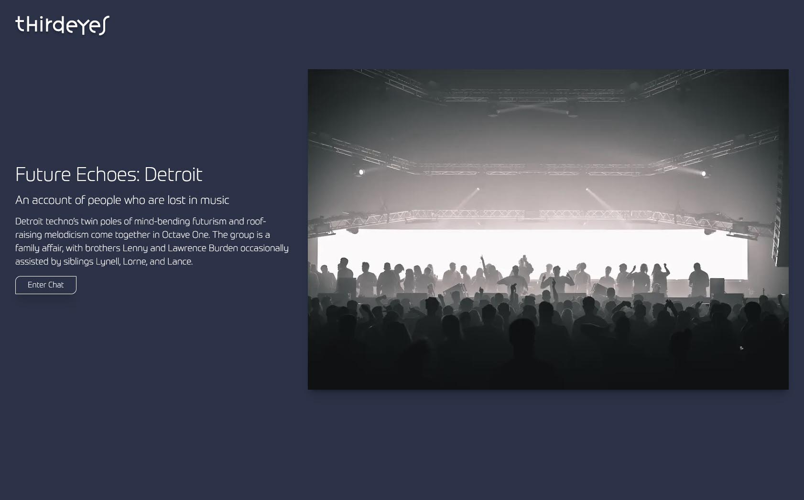

# Thirdeyes



## What in the ... ?

Thirdeyes is an exploration into fine-tuning LLMs. The goal is to fine tune a model to get it to speak with a specific editorial style/tone of voice.

My client works with different platforms that each have their very specific styles of presenting their information. Thirdeyes should allow the client to select a platform, then the style of an individual writer working for the client. The output will be copy written in the style of a specific individual tailored for a specific platform.

<br>

# Working w Large Language Models

The app is currently wired up with Llama-2-13b-chat. Though I'm rapidly testing other models, so YMMV ... your model may vary. heh.

For LLama 2 I followed the Amazon's guide, [Customize models in Amazon Bedrock with your own data using fine-tuning and continued pre-training](https://aws.amazon.com/blogs/aws/customize-models-in-amazon-bedrock-with-your-own-data-using-fine-tuning-and-continued-pre-training/).

The fine-tuning job was based on a dataset provided by a client. Concurrently I'm actively exploring fine-tuning for a public version of the app using the [18,393 Pitchfork Reviews](https://www.kaggle.com/datasets/nolanbconaway/pitchfork-data) dataset on Kaggle.

I'm struggling with Amazon support to get the quota increased so I can properly test my fine-tuned model. And for that reason I'm switching up to OpenAI. I had intended on the finished app to run some flavor of GPT, but wanted to give AWS a go. If they don't want my business that's fine. The less money I give to Amazon the better.

At the same time I'm getting a lot of experience working within AWS services. I like it lots. They seem to end up being the necessary evil from time to time.


<br>

# Vercel AI SDK

The app is built on top of the [Vercel AI SDK](https://sdk.vercel.ai/docs).

ATM it leverages AWS Bedrock for access to LLMs. And I scaffolded out the app using the [AWS Bedrock v Vercel AI documentation](https://sdk.vercel.ai/docs/guides/providers/aws-bedrock). It's a quick single page document, but gave me enough to get started.


<br>


# Carbon Design System

https://carbondesignsystem.com/

Carbon is IBM’s open source design system for products and digital experiences. With the IBM Design Language as its foundation, the system consists of working code, design tools and resources, human interface guidelines, and a vibrant community of contributors.


## Carbon v React

https://carbondesignsystem.com/developing/react-tutorial/overview

good info about applying the **Grid system**


## Grid

### Using the Grid Component

https://carbondesignsystem.com/developing/react-tutorial/step-2#add-landing-page-grid

The CSS Grid is a 16 column grid. We will specify the span of a `<Column>` using the sm, md, and lg props. For example, `<Column sm={2} md={8} lg={8}/>` means the column will span 2/4 columns at the small breakpoint, 8/8 columns at the medium breakpoint, 8/16 columns at the large breakpoint.


## Brekpoints

I had to hunt for them ... Better sense in the making

```scss
$grid-breakpoints: (
  sm: (
    columns: 4,
    margin: 0,
    width: convert.to-rem(320px),
  ),
  md: (
    columns: 8,
    margin: convert.to-rem(16px),
    width: convert.to-rem(672px),
  ),
  lg: (
    columns: 16,
    margin: convert.to-rem(16px),
    width: convert.to-rem(1056px),
  ),
  xlg: (
    columns: 16,
    margin: convert.to-rem(16px),
    width: convert.to-rem(1312px),
  ),
  max: (
    columns: 16,
    margin: convert.to-rem(24px),
    width: convert.to-rem(1584px),
  ),
) !default;
```


## Carbon Layout

https://github.com/carbon-design-system/carbon/tree/main/packages/layout

#### Not sure yet if i'm going to use carbon/layout

`@carbon/layout` provides a couple of useful utilities alongside the specification for the grid system for the IBM Design Language. This package includes:


<br>


# Mechaneyes Notes

- Explore native Grid component v CSS classes
- Track TS Icons issue
  - Thursday, 14 Dec 2023 18.15.33 PM PST
  - https://github.com/carbon-design-system/carbon/pull/14714#issuecomment-1777878629


<br>

# Construction Soundtrack

### Lora - Robag's Fandara Qualv NB
[Spotify](https://open.spotify.com/track/7MeqyBDAMU218wNmYSG1ei?si=1f6303ff55f643a2)

### Max Cooper - Live at the Barbican (Yearning for the Infinite)
[YouTube](https://www.youtube.com/watch?v=owdva7V2M0o&t=1121)

### The Upper Cuts (2023 Edition)
by Alan Braxe, Fred Falke & Friends  
[Bandcamp](https://alanbraxe.bandcamp.com/album/the-upper-cuts-2023-edition)  
[Spotify](https://open.spotify.com/album/0TeXdrfFO67UgPpj1mMUAM?si=ugtAnrKZT42zYmmLNOgprQ)